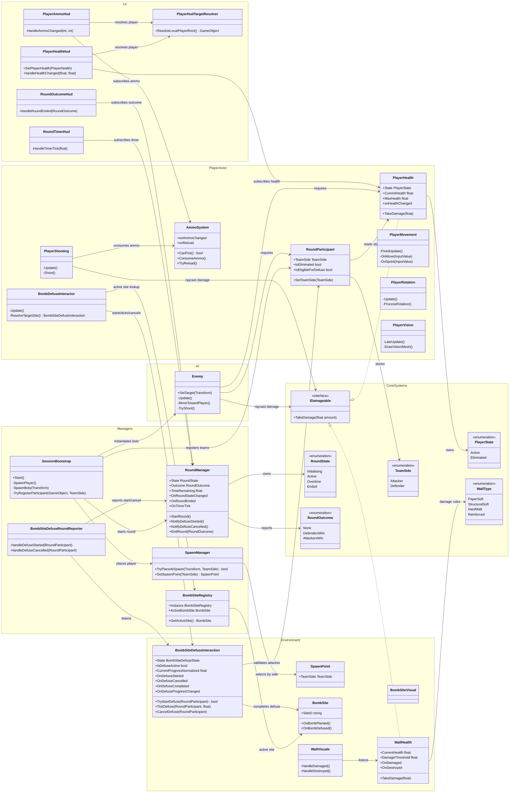

# Game Architecture Document

## 1. Overview
This document outlines our team's technical architecture for **[Working Title: Tactical Top-Down]**. It is designed to support 3v3 online multiplayer, advanced line-of-sight mechanics (Fog of War), and a highly destructible environment, while adhering to the standard workflows and coding conventions defined in our team's Way of Working (`WoW.md`).

- **Engine:** Unity 6000.3.6f1
- **Target Platform:** PC
- **Network Topology:** Client-Host (Server-Authoritative) model. As our primary goal for this university module is to deliver a stable, well-engineered playable game, we are focusing on ease of setup and stability using a host-client model rather than implementing complex dedicated server cheat-prevention.

---

## 2. Multiplayer & Networking Architecture

We have decided on a simplified **Client-Side/Host-Client model**. Given our tight development timeframe and the fact that we have members who are new to Unity networking, complex server-authoritative calculations (like Server-Side Fog of War) are out of scope. Our priority is a functional, stable multiplayer experience.

### 2.1. Network Framework
- We will be using **Unity Netcode for GameObjects (NGO)** or **Photon Fusion (Shared/Host Mode)**.
- **Host-Client:** One player acts as the Host (Server + Client). Our architecture will trust the clients to handle their own rendering correctly.

### 2.2. Match & Team Management
- **Matchmaking/Lobbies:** We will implement a lobby system to group 6 players, dividing them into Attackers and Defenders.
- **Game State Machine:** A global `NetworkMatchManager` handles the match sequence (Prep phase, Action phase, Round End, Team Swap) and syncs the current Phase to all clients.

### 2.3. Vision Culling (Fog of War) - Client-Side Approach
*Note: While a server-authoritative vision system prevents cheats, it introduces significant complexity (server-side raycasting, grid prediction) that we determined is unfeasible for our 4-person team's schedule.*
- **Client-Side Vision Casting:** The "Fog of War" will be calculated locally on each client. The server will sync the positions of all players to all clients, but the client's local machine will determine if an enemy is rendered based on line-of-sight raycasts and the local vision cone.
- **Rendering Tricks over Math:** Instead of complex networking visibility rules, we will utilize Unity's rendering layers and stencil buffers. Enemies outside the local player's vision cone (or behind walls) will simply be moved to an invisible rendering layer.
- **Trusting the Client:** This architecture inherently trusts the client with enemy positional data. While susceptible to wall-hacks in a commercial environment, it drastically reduces our development time, networking overhead, and server performance costs, making it the most sensible approach for our module submission.
- **No Shared Vision:** The client will evaluate visibility strictly from the local player's perspective, without sharing vision with teammates, to encourage voice communication.

---

## 3. Core Systems & Component Design

Adhering to the **Single Responsibility Principle (SRP)** outlined in our `WoW.md`, overarching "Manager" classes will be broken down into specific modular components so our team can work in parallel without merge conflicts.

### 3.1. Player Entity Architecture
We are designing the player prefab to be entirely modular.
*   `PlayerNetworkEntity`: Handles network identity and ownership.
*   `PlayerMovement`: Handles WASD inputs, applies rotational speed limits (no instant 360s), and sends movement vectors to the server.
*   `PlayerVision`: Manages the local UI rendering of the vision cone.
*   `PlayerHealth`: Manages state (Active, DBNO, Eliminated) and RPCs for damage and revivals.
*   `PlayerLoadout`: Manages equipped primary/secondary weapons and gadgets.
*   `PlayerShooting`: Handles weapon firing logic, ammo counters, and raycasting for bullets (adhering to SRP).

### 3.2. Environmental Destruction System (Tilemaps vs. Prefabs)
While prototyping with Unity Tilemaps is fast, **we have decided against using Tilemaps for the final destructible environment.** Tilemaps are optimized for static grids; managing individual tile health, networking the destruction of specific tiles across clients, and handling complex interactions (like reinforcing a wall) within a single Tilemap component is notoriously difficult and prone to bugs.
*   **Modular Prefab Grid:** Instead of Tilemaps, we will build the map by snapping individual Wall Prefabs manually to a grid in the Unity Editor. Each wall will be a distinct networked object (`NetworkBehaviour`) with its own health, material type (Paper Soft, Structural Soft, Hard Wall), and rendering layer.
*   `EnvironmentDestructionManager`: Listens for local damage events (bullets, soft/hard breaches). When a health threshold is met, it triggers a network-wide RPC to swap the intact wall prefab with a destroyed variant or disables its collider.
*   `WallReinforcement`: Defenders interact with soft wall prefabs. The host/local client validates the reinforcement pool and, if valid, changes the wall's type to "Reinforced", updating visuals across all clients via RPC.

### 3.3. Audio-Visual Feedback System
*   Loud actions (sprinting, shooting, breaching) will trigger a `NetworkAudioEvent`.
*   The server decides the radius of the sound and pushes an RPC to all clients within range.
*   The local `VisualAudioManager` instantiates a "visual ripple" at the event's coordinates, ensuring players receive visual cues even if the source is outside their vision cone or behind walls.

### 3.4. Match Logic & Objectives
*   `RoundManager`: Tracks the timer and handles team scoring. Crucially (per our GDD section 2.2), it is programmed to ensure Attackers only win by defusing the bomb, not just by eliminating all Defenders. It also triggers `OnDefenderWin()` if the timer expires or all Attackers are eliminated.
*   `BombManager`: Networked object that tracks defusal progress. If defused, it triggers `RoundManager.OnAttackerWin()`.
*   `TeamManager`: Tracks the pool of living players and team resources (e.g., reinforcement pools).

---

## 4. Unity Project Structure & Workflow

To maintain our **Prefab Rule** and minimize merge conflicts among the four of us, our project structure strictly separates experimental sandbox logic from production assets.

```text
Assets/
├── _Sandbox/
│   ├── [DevName1]/         # Private testing scenes for individuals
│   └── [DevName2]/
├── Art/                    # 2D Sprites, Models, Materials
├── Audio/                  # Music, SFX for visual/audio ripples
├── Core/
│   ├── Network/            # Matchmakers, Network Managers
│   └── Systems/            # Non-monobehaviour logic, static helpers
├── Prefabs/
│   ├── Characters/         # Player and AI Prefabs
│   ├── Environment/        # Wall, Floor, Prop Prefabs
│   ├── Objectives/         # The Bomb Prefab
│   └── Gadgets/            # Grenades, Breaches Prefabs
├── Scenes/
│   ├── MainMenu.unity      # Strictly for UI/Lobby
│   └── Maps/               # Actual playable levels
└── Scripts/
    ├── Player/             # SRP-compliant player scripts
    ├── Environment/        
    └── GameModes/
```

### 4.1. Implementation Guidelines
- **Prefabs Only:** We will build new features in our respective `_Sandbox/` folders, attaching scripts to Prefabs. Once tested, the Prefab is moved to the `Prefabs/` folder and merged via PR.
- **Optimization:** As agreed upon in our WoW, we will avoid `FindObjectsOfType` or `GetComponent` in `Update()`. All component references must be cached in `Awake()`.
- **Exposed Variables:** We will use `[SerializeField] private` for all customizable variables. No public variables or magic numbers, maintaining strict encapsulation to ensure our codebase remains clean and easy for the whole team (and module graders) to read.

---

## 5. Current Program Architecture UML

The current implementation is a local playable-session slice of the larger planned architecture above. It is organised around prefab-level MonoBehaviour components: `SessionBootstrap` wires the scene together once, `RoundManager` owns round state and timer events, player and enemy actors are composed from focused movement/combat/health scripts, bomb-site defuse logic reports into the round system, and HUD scripts subscribe to gameplay events instead of driving gameplay state. This matches the SRP direction in `WoW.md`, but it is not yet the full networked architecture described in sections 2 and 3: there is no implemented `NetworkMatchManager`, synced destruction manager, network audio ripple system, or loadout manager in the current script set.



One important integration gap to track in the next gameplay task: `BombSiteDefuseInteraction` raises `OnDefuseCompleted`, but the current `BombSiteDefuseRoundReporter` only forwards defuse start and cancel events to `RoundManager`. Until completion is forwarded to `RoundManager.EndRound(RoundOutcome.AttackersWin)`, the implemented code does not fully satisfy the GDD rule that attackers win by defusing the bomb.
